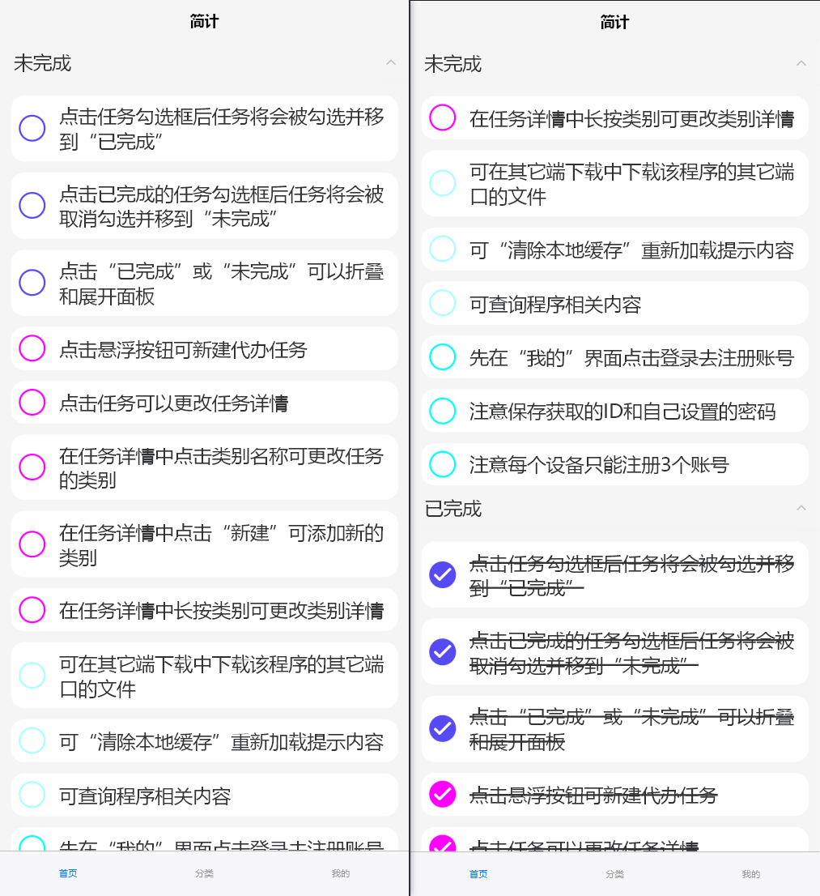
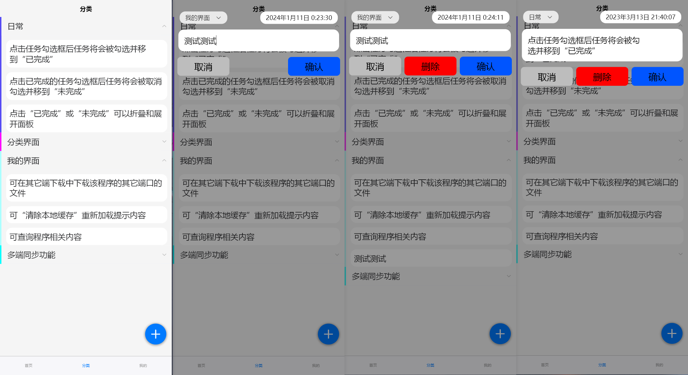
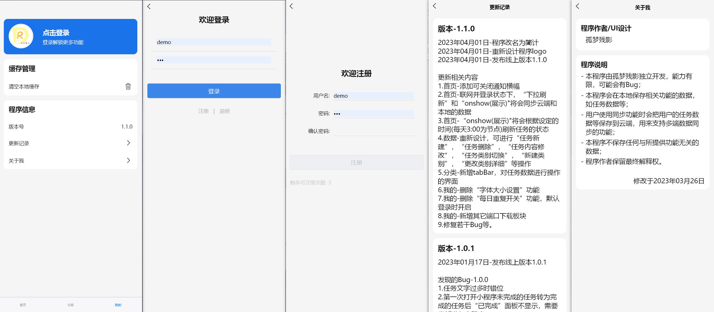

# 简计

## 1. 基本信息

- 作者: GMCY
- 网站: [简计-手机版](https://static-mp-d58017b5-91a2-424b-b67a-2d55c2720b72.next.bspapp.com)
- 仓库: [GitHub](https://github.com/GMCY2020/Vue-SimplePlane) | [Gitee](https://gitee.com/GMCY2020/Vue-SimplePlane)
- 话题(GitHub): [vue](https://github.com/topics/vue)
- 创建时间: 2022/12/31

## 2. 介绍

说明
- 本来主要是微信小程序的, 但阿里云服务器忘记点续费(开发者免费, 那时候每个月要点一次)了, 数据库被删除了(ノへ￣、). 鸽子放飞中...

## 3. 环境

编辑器
- `HBuilderX`

框架
- `vue`

## 4. 使用

解压后 `HBuilderX` 打开, 运行到浏览器即可

## 5. 效果图

首页

分类

我的
